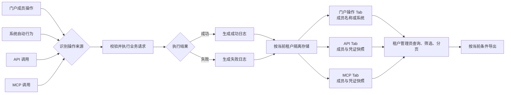

# 门户操作日志 PRD 重写设计

## 目标

将「门户操作日志」PRD 从左右分屏改为单列瀑布流，按照正式 PRD 章节顺序连续展示；核心流程使用流程图表达；系统自动行为纳入日志展示范围，并合并进入「门户操作」Tab。

## 已确认决策

- PRD 页面采用单列瀑布流，不使用左右分屏、折叠章节或悬浮侧栏。
- 保留三个来源 Tab：门户操作、API、MCP，不新增系统操作 Tab。
- 系统定时任务、自动重试、自动推送等系统自动行为进入「门户操作」Tab，操作者显示“系统”。
- 门户成员主动操作进入「门户操作」Tab，操作者显示成员名称。
- API、MCP 操作分别进入对应 Tab，并保留操作发生时的成员与凭证名称快照。
- 进入页面、搜索、筛选、切换 Tab 等浏览行为不记录。
- 不提供操作详情入口，日志信息以列表和导出内容为准。
- 核心流程使用流程图，不再使用步骤表格代替。

## 页面结构

PRD 页面从上到下依次展示：

1. 版本信息
2. 变更日志
3. 文档说明
4. 需求背景
5. 目标
6. 用户故事
7. 需求范围
8. 用户场景与交互说明
9. 用户操作流程
10. 非功能需求
11. 埋点

所有章节共享同一内容列和阅读宽度。章节之间只使用垂直留白分隔，不增加卡片分栏或独立滚动容器。

## 章节内容

### 版本信息与变更日志

- 版本信息表使用「版本号 / 创建日期」。
- 变更日志表使用「时间 / 版本号 / 变更人 / 主要变更内容」。
- 本次变更记录 PRD 改为单列瀑布流、核心流程改为流程图、系统自动行为纳入门户操作。

### 文档说明

只解释三个容易产生歧义的口径：

- 门户操作：成员在取数宝前台发起的业务操作，以及本租户范围内的系统自动行为。
- 系统自动行为：系统定时任务、自动重试、自动推送等无需成员当次点击即可执行的业务动作。
- 凭证快照：API、MCP 操作发生时保存的成员和凭证名称、标识，用于历史追溯。

### 需求背景与目标

需求背景明确租户管理员缺少统一审计入口，无法追溯本租户成员、成员凭证和系统自动行为产生的业务操作。

目标明确租户管理员可在个人中心按门户操作、API、MCP 三类来源查看并导出本租户操作日志，同时保证租户隔离和敏感信息保护。

### 用户故事

- 租户管理员追溯成员主动操作，定位操作者、功能模块、操作内容和结果。
- 租户管理员追溯系统自动行为，识别自动任务、自动重试或自动推送的实际执行结果。
- 租户管理员复核 API、MCP 调用对应的成员与凭证快照。
- 租户管理员导出当前查询范围内的本租户脱敏日志。

### 需求范围

需求范围覆盖入口权限、来源分类、日志查询与筛选、列表分页、系统自动行为、API/MCP 凭证快照、日志导出和异常反馈。操作详情、日志编辑删除、保留周期配置、浏览行为记录和跨租户能力不在本期范围。

### 用户场景与交互说明

- 仅租户管理员展示「个人中心 / 操作日志」入口；普通成员无入口，接口直接访问也必须拒绝。
- 门户操作、API、MCP 分 Tab 展示；切换 Tab 后按对应来源查询。
- 系统自动行为与成员门户操作共同展示在「门户操作」Tab，通过操作者“系统”与成员名称区分。
- 三个 Tab 共用时间范围、操作者、功能模块、操作类型筛选；API、MCP 额外支持凭证名称筛选。
- 列表默认按操作时间倒序分页，列表行不提供详情入口。
- 导出范围与当前租户、Tab、时间范围和筛选条件一致。
- 查询失败时保留当前条件并提供重新加载；导出失败时保留当前条件并允许重试。

## 用户操作流程

流程图采用从左到右的主链路，并在触发来源和展示归属处体现分支：

归属规则：门户成员操作和系统自动行为进入门户操作 Tab；API、MCP 分别进入对应 Tab。日志写入失败不得改变原业务操作结果，应进入服务端告警与补偿。

## 非功能需求

- 权限：仅租户管理员可访问页面和接口。
- 租户隔离：查询、分页和导出均由服务端按当前登录租户强制限定。
- 安全：Token、API Key、密码、Cookie、密钥和完整敏感参数不得写入页面或导出内容。
- 留存：日志保留 180 天，到期由系统自动清理，用户不可编辑或删除。
- 查询：默认近 7 天，单次查询跨度最长 90 天。

## 埋点

本需求未新增产品分析埋点，PRD 中按模板保留「- / - / -」占位，不将审计日志本身写成前端埋点。

## 异常与边界

- 用户取消、仅前端校验且未发出请求、字段值未实际变化时不生成日志。
- 浏览行为不生成日志。
- 系统自动行为无成员操作者时显示“系统”，不得伪造成员归属。
- API、MCP 凭证撤销或成员删除后，历史日志仍使用操作发生时的快照。
- 查询失败不展示旧数据或虚构内容；无数据按当前 Tab 和筛选条件展示空状态。
- 日志写入失败只进入服务端告警和补偿，不向用户误报原业务失败。

## 验证方式

- 结构测试约束正式章节顺序、单列布局和无双栏网格。
- 内容测试约束系统自动行为进入门户操作 Tab、操作者显示“系统”，且不再出现“系统自动行为不展示”的旧口径。
- 流程测试约束核心流程使用 Mermaid 流程图并覆盖四类触发来源、成功失败、租户隔离、三 Tab 归属和导出。
- 构建验证 TypeScript 与 Vite 编译通过。
- 内嵌浏览器验证 PRD 为连续单列阅读、流程图正常渲染、页面无横向分屏。
